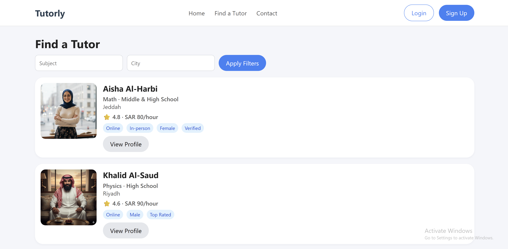
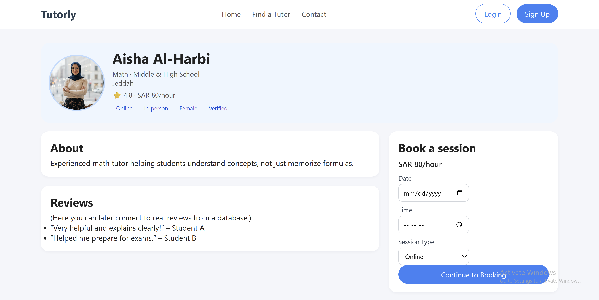
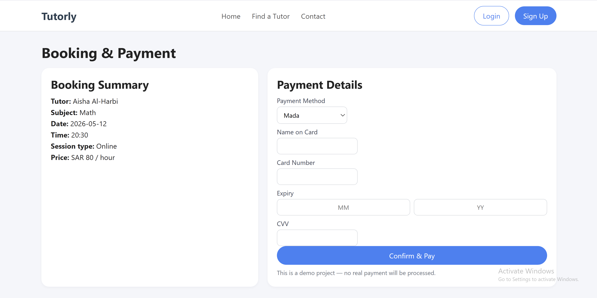

# Tutorly – Tutor Uberization Platform

Tutorly is a full-stack tutoring marketplace web application designed to connect students and parents with qualified tutors through a centralized booking and communication platform.

The system allows users to search tutors, view tutor profiles, schedule sessions, simulate payments, and manage bookings through a responsive and user-friendly interface.

---

## Overview

The platform was developed following software engineering principles and focuses on modular architecture, usability, scalability, and responsive front-end/back-end integration.

Tutorly provides:
- Tutor discovery and filtering
- Tutor profile management
- Session booking workflows
- Payment simulation
- Booking tracking
- Messaging interfaces
- Responsive UI across devices

---

## Features

- Tutor search by subject and city
- Tutor profile pages
- Booking and payment workflow
- Booking details and session tracking
- Messaging/chat interface
- Login and registration pages
- Responsive mobile-friendly UI
- Modular PHP structure
- Dynamic filtering using GET requests
- Reusable header/footer architecture

---

## Technologies Used

- PHP
- HTML5
- CSS3
- JavaScript
- MySQL (prepared for integration)
- Responsive Web Design
- Software Engineering Principles

---

## Project Structure

```text
Tutorly-Platform/
│
├── index.php
├── tutors.php
├── tutor_profile.php
├── booking.php
├── booking_success.php
├── booking_details.php
├── bookings.php
├── login.php
├── register.php
├── messages.php
├── contact.php
│
├── includes/
│   ├── header.php
│   ├── footer.php
│   ├── data.php
│   └── db.php
│
├── assets/
│   ├── css/
│   │   ├── style.css
│   │   ├── home.css
│   │   ├── tutors.css
│   │   ├── profile.css
│   │   ├── booking.css
│   │   ├── auth.css
│   │   ├── messages.css
│   │   └── contact.css
│   │
│   └── img/
│
├── screenshots/
│   ├── homepage.png
│   ├── tutor-search.png
│   ├── tutor-profile.png
│   ├── booking.png
│   └── mobile-view.png
│
├── docs/
│   ├── SRS.pdf
│   └── Presentation.pdf
│
└── README.md
```

---

## Screenshots

### Homepage


---

### Tutor Search


---

### Tutor Profile


---

### Booking & Payment


---

### Mobile Responsive View


---

## Core System Components

### Tutor Search & Filtering
Users can search tutors dynamically by:
- subject
- city
- session type

using PHP filtering and GET requests.

---

### Tutor Profiles
Each tutor profile includes:
- subject specialization
- city
- pricing
- ratings
- tutor tags
- biography
- booking functionality

---

### Booking Workflow
The booking system supports:
- session scheduling
- online or in-person sessions
- payment method selection
- booking confirmation flow

---

### Messaging System
A simulated messaging interface demonstrates communication between students and tutors.

---

### Authentication Pages
The platform includes:
- Login page
- Registration page
- User role selection

---

## How to Run

1. Install XAMPP or any PHP server environment.

2. Move the project folder into:

```text
htdocs/
```

3. Start:
- Apache
- MySQL

4. Open the browser and run:

```text
http://localhost/Tutorly-Platform
```

---

## Database Configuration

The project includes a prepared database connection structure inside:

```text
includes/db.php
```

Update the database credentials with your local setup before running the project.

---

## Future Improvements

- Real database integration
- Secure authentication system
- Real-time messaging
- Online payment gateway
- Tutor reviews stored in database
- AI-based tutor recommendation system
- Admin dashboard
- Session notifications

---

## Team Members

- Mashael Saeed
- Sarah Elshiaty
- Seifeldin Elshiaty

---

## License

This project is for educational purposes only.
